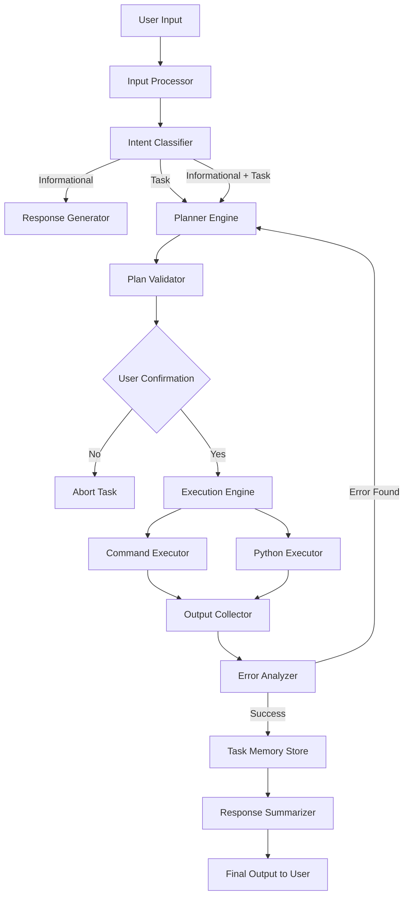
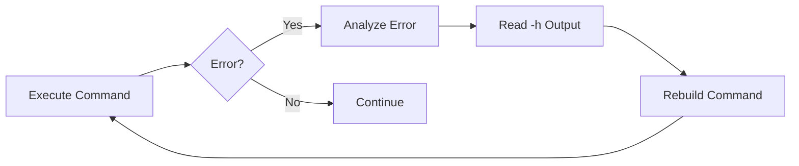
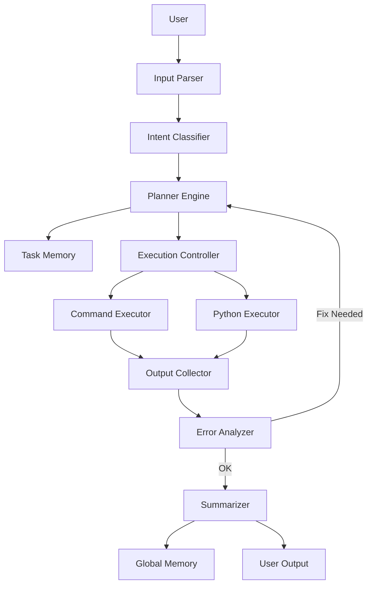

Here is the **🧠 Advanced Agent Architecture Diagram** for **Hackers AI**
(Professional, production-ready structure)

---

# 🧠 Hackers AI – Advanced Agent Architecture

---

## 🔷 High-Level Intelligent Flow



---

# 🏗 Layered Architecture Model

---

## 🟢 1️⃣ Interface Layer

**Purpose:** Interaction boundary

Components:

* CLI Interface
* Slash Command Handler (`/clear`, `/exit`, `/switch`)
* Real-time Output Renderer

---

## 🔵 2️⃣ Intelligence Layer

**Core Brain of the System**

### 🧩 Input Processor

* Parses user input
* Detects URLs, IPs, file paths

### 🧠 Intent Classifier

Classifies request as:

* Informational
* Task
* Informational + Task

### 📋 Planner Engine

* Generates structured execution plan
* Outputs JSON-like instructions

Example structure:

```json
{
  "type": "task",
  "steps": [
    {"tool": "nmap", "command": "nmap -sV target.com"},
    {"tool": "nikto", "command": "nikto -h target.com"}
  ]
}
```

---

## 🟡 3️⃣ Execution Layer

Handles real-world system interaction.

---

### ⚙ Command Executor

* Runs Linux commands
* Captures:

  * stdout
  * stderr
* Streams output in real time
* Detects exit codes

---

### 🐍 Python Execution Engine

Used only if:

* Task cannot be completed via direct command

Process:

1. Create temp `.py`
2. Execute
3. Capture output
4. Delete file

---

### 🔁 Error Analyzer (Self-Healing Core)

If error detected:

* Check invalid flags
* Run `<tool> -h`
* Analyze help output
* Recraft command
* Retry execution

This forms a **closed correction loop**:



---

## 🔴 4️⃣ Memory Layer

---

### 🧠 Global Memory

* Stores last N conversations
* Cleared on restart

---

### 📂 Task Memory

* Stores:

  * Current plan
  * Executed steps
  * Command outputs
* Isolated per task

---

## 🟣 5️⃣ Security & Permission Layer

* Checks for `sudo`
* Validates system privileges
* Controls installation permissions

---

## 🟤 6️⃣ Vulnerability Testing Layer

---

### 🌐 Web Testing Module

* XSS
* SQLi
* Directory brute force
* Subdomain enumeration
* LFI / SSRF / CSRF
* File upload testing

Tool orchestration based on:

* Target type
* Detected tech stack

---

### 📡 Wireless Testing Module

* Network scanning
* WPA/WPS testing
* Evil twin
* Deauth
* Fake AP
* Multi AP simulation

---

# 🧬 Internal Data Flow Model



---

# ⚡ Advanced Autonomous Features

---

## 🔁 Self-Correcting Execution Loop

* Detect error
* Interpret failure reason
* Auto-check documentation (`-h`)
* Regenerate command
* Retry intelligently

---

## 🧠 Adaptive Planning

Based on:

* OS detected
* Installed tools
* Command outputs
* Previous task results

---

## 🔀 Multi-Model Support

Triggered via:

```
/switch "<model_name>"
```

Model affects:

* Planning style
* Verbosity
* Aggressiveness in exploitation attempts

---

# 🧩 Recommended Folder Structure

```id="arch001"
hackers_ai/
│
├── core/
│   ├── input_processor.py
│   ├── classifier.py
│   ├── planner.py
│   ├── executor.py
│   ├── python_runner.py
│   ├── error_analyzer.py
│   └── summarizer.py
│
├── memory/
│   ├── global_memory.py
│   └── task_memory.py
│
├── modules/
│   ├── web_vuln.py
│   ├── wireless.py
│   └── system_profiler.py
│
├── utils/
│   ├── command_utils.py
│   └── help_parser.py
│
├── cli.py
└── main.py
```

---

# 🧠 Intelligence Level Summary

Hackers AI Architecture provides:

* ✅ Structured planning
* ✅ Step confirmation
* ✅ Real-time execution
* ✅ Error self-healing
* ✅ Memory separation
* ✅ Tool awareness
* ✅ Vulnerability automation
* ✅ Modular expansion

---
