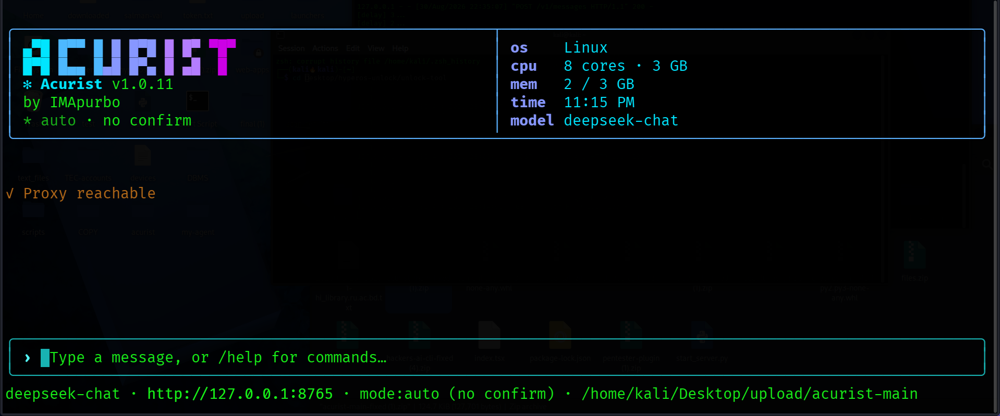

<div align="center">

# acurist

**A terminal AI agent with a Claude Code–style interface — built for your own proxy and model.**

[](https://www.npmjs.com/package/acurist)
[](./LICENSE)
[](https://nodejs.org)

</div>

---

## What is acurist?

Acurist is a lightweight, open-source terminal agent that gives you a polished, Claude Code–style UI — scrolling transcript, boxed input, live spinner, tool-call cards with truncated output, and shell confirmation prompts — without locking you into any single AI provider. Point it at any OpenAI-compatible local proxy (Ollama, LM Studio, a custom server) and it works.

---

## Screenshot



---

## Features

| Capability | acurist | Claude Code | Cursor | Copilot |
|---|:---:|:---:|:---:|:---:|
| Run shell commands (auto / manual) | ✅ | ✅ | ❌ | ❌ |
| Auto background for long-running processes | ✅ | ❌ | ❌ | ❌ |
| Read & write files | ✅ | ✅ | ✅ | ✅ |
| Edit files in-place | ✅ | ✅ | ✅ | ❌ |
| Search with grep / glob | ✅ | ✅ | ✅ | ❌ |
| Fetch web URLs (`@url`) | ✅ | ✅ | ❌ | ❌ |
| MCP server support | ✅ | ✅ | ❌ | ❌ |
| Custom AI agents | ✅ | ❌ | ❌ | ❌ |
| Plugin marketplace | ✅ | ❌ | ❌ | ❌ |
| Telegram bridge | ✅ | ❌ | ❌ | ❌ |
| Bring your own proxy / model | ✅ | ❌ | ❌ | ❌ |
| Built-in model aliases (auto-routed) | ✅ | ❌ | ❌ | ❌ |
| Live tool-call working process display | ✅ | ✅ | ❌ | ❌ |
| Session save / load | ✅ | ❌ | ❌ | ❌ |
| Works fully offline | ✅ | ❌ | ❌ | ❌ |
| Free & open source | ✅ | ❌ | ❌ | ❌ |

---

## Requirements

- **Node.js** ≥ 22
- A running **local proxy** that speaks the Anthropic messages API (default: `http://localhost:8765`)
  - **Built-in**: [deeptunnel](https://github.com/IMApurbo/deeptunnel) — routes to DeepSeek V3/R1 for free (auto-launched when `DEEPSEEK_TOKEN` is set)

---

## Quick start with DeepSeek (free)

acurist ships with built-in support for [deeptunnel](https://github.com/IMApurbo/deeptunnel), which proxies requests to DeepSeek's web chat — no API key needed, just a bearer token.

### 1. Install deeptunnel

```bash
pip install deeptunnel
```

### 2. Get your DeepSeek bearer token

1. Open [chat.deepseek.com](https://chat.deepseek.com) and log in
2. Open DevTools → Network tab → send any message
3. Find the `Authorization: Bearer …` header — copy the token

### 3. Run acurist

```bash
export DEEPSEEK_TOKEN="your-bearer-token"
npm install -g acurist
acurist
```

deeptunnel starts automatically. No second terminal needed.

### Model selection

| Flag | Model |
|---|---|
| *(default)* | DeepSeek V3 — fast |
| `--ds-model expert` | DeepSeek R1 — reasoning |
| `--ds-think` | Enable thinking mode |
| `--ds-no-search` | Disable web search |

```bash
acurist --ds-model expert --ds-think
```

Multiple tokens for rotation (avoids rate limits):

```bash
export DEEPSEEK_TOKEN="token1,token2,token3"
```

---

## Installation

```bash
npm install -g acurist
```

Then just run it from any directory:

```bash
acurist
```

### Start with options

```bash
# Use a specific model
ACURIST_MODEL=llama3 acurist

# Point at a different proxy
ACURIST_PROXY=http://localhost:11434 acurist

# Require confirmation before every shell command
acurist --mode manual

# Start with a custom agent pre-loaded
acurist --agent my-agent
```

---

## Built-in model aliases

acurist ships two built-in model names that automatically map to the best available slot on your proxy — no manual model ID lookup needed.

| Alias | Routes to | Description |
|---|---|---|
| `claude-sonnet-4-6` *(default)* | `auto/best-coding` | Smart & fast — best for most tasks |
| `claude-haiku-4-5-20251001` | `auto/best-fast` | Lightweight — lowest latency |

The mapping is transparent: you select the alias with `/model`, and every request is silently sent as the proxy's `auto/` routing ID. The current alias **and** the resolved proxy model are both shown in the status bar at the bottom of the screen:

```
claude-sonnet-4-6 →auto/best-coding · mode:auto · /home/user/project
```

### Switching models

```
/model                          show current model and its proxy route
/model auto                     reset to smart default (claude-sonnet-4-6)
/model claude-haiku-4-5-20251001  switch to the fast alias
/model list                     show all aliases + live proxy model list
/model auto/best-reasoning      use a proxy model directly by ID
```

`/model list` merges the two built-in aliases (always shown) with whatever models your proxy reports, so you always have a complete picture in one place.

---

## Live tool-call display

Every tool call is shown inline in the transcript as it happens — Claude Code style:

```
⏺ run_shell   python3 -m http.server 8080
  ⎿ Background job running.
      job_id: bg_1720000000_abc12
      pid:    31337
      log:    /tmp/bg_1720000000_abc12.log

    Startup output (first 3s):
    Serving HTTP on 0.0.0.0 port 8080 ...
```

The spinner in the status bar also updates to show the active tool name while it runs:

```
⣾ ⏺ run_shell running…
```

Long outputs are automatically truncated in the transcript and written to a temp log file. The full path is shown so you or the agent can read it with `read_file`.

---

## Auto background for long-running processes

Servers, watchers, and GUI launchers are automatically detected and run in the background — you never have to add `&` or worry about a 60-second timeout killing your server mid-task.

**Automatically backgrounded commands include:**

- HTTP servers — `python3 -m http.server`, `uvicorn`, `gunicorn`, Flask/Django
- Dev servers — `vite`, `next dev`, `npm start`, `npm run dev`, `nodemon`, `parcel`, `astro`, Deno
- File watchers — `tail -f`, `watch`, `inotifywait`
- Network listeners — `nc -l`, `netcat -l`
- GUI launchers — `firefox`, `chrome`, `chromium`, `xdg-open`
- Infinite loops — `while true`, `while :`, `sleep infinity`

When a long-running command is detected, acurist:

1. Spawns it detached in the background immediately
2. Captures the first 3 seconds of startup output
3. Returns a `job_id` and the startup output to the agent — so it can confirm the server booted correctly and move on

The agent never stalls waiting for a process that won't exit. Use `read_bg_log` to tail output or kill the job later.

```
run_shell background:true settle_seconds:8   ← force background + wait longer for slow starts
read_bg_log job_id:"bg_…" tail_lines:100     ← check output
read_bg_log job_id:"bg_…" kill:true          ← stop the process
```

You can also set `background: true` explicitly on any command to force background mode regardless of detection.

---

## Configuration

| Environment variable | Default | Description |
|---|---|---|
| `ACURIST_PROXY` | `http://localhost:8765` | Base URL of your local proxy |
| `ACURIST_MODEL` | `claude-sonnet-4-6` | Model alias or ID passed to the proxy |
| `DEEPSEEK_TOKEN` | — | Bearer token(s) for auto-launching deeptunnel |
| `ACURIST_DS_MODEL` | `fast` | DeepSeek model tier: `fast` or `expert` |
| `ACURIST_DS_SEARCH` | `true` | Set to `false` to disable web search in deeptunnel |
| `ACURIST_DS_THINK` | `false` | Set to `true` to enable thinking mode in deeptunnel |

Settings can also be changed at runtime with `/proxy` and `/model` and are persisted across sessions.

---

## Slash commands

Type `/` in the input box to see completions. Every command with sub-options shows a second picker when you press Space after the command name.

### General

| Command | Description |
|---|---|
| `/help` | List all commands and keybindings |
| `/clear` | Reset transcript and agent context |
| `/undo` | Remove the last user + assistant exchange |
| `/exit` | Quit (or press `Ctrl+C` twice) |

### Model & proxy

| Command | Description |
|---|---|
| `/model` | Show current model and its resolved proxy route |
| `/model auto` | Reset to smart default (`claude-sonnet-4-6 → auto/best-coding`) |
| `/model <name>` | Switch model alias or proxy model ID (persisted) |
| `/model list` | Show built-in aliases and all proxy-reported models |
| `/proxy <url>` | Switch proxy base URL (persisted) |

### Permissions

| Command | Description |
|---|---|
| `/mode auto\|manual` | Toggle global shell permission mode |
| `/perm <tool> auto\|manual\|reset` | Set a per-tool permission override |

### Sessions & history

| Command | Description |
|---|---|
| `/save [name]` | Save current session to `~/.acurist/sessions/` |
| `/load <name>` | Restore a saved session |
| `/sessions` | List all saved sessions |
| `/export [file]` | Dump transcript to a Markdown file in cwd |
| `/history [query]` | Fuzzy-search persistent input history |

### Agents

Create custom AI personas with their own system prompts.

| Command | Description |
|---|---|
| `/agent create` | Interactive wizard — describe the agent, AI generates the system prompt |
| `/agent use <name>` | Activate an agent for this session |
| `/agent info <name>` | Show full details: system prompt, MCPs, plugins |
| `/agent list` | List all saved agents |
| `/agent delete <name>` | Delete an agent |

### MCP servers

Connect external tools via the [Model Context Protocol](https://modelcontextprotocol.io).

| Command | Description |
|---|---|
| `/mcp add <name> <url>` | Connect a new MCP server |
| `/mcp remove <name>` | Disconnect an MCP server |
| `/mcp list` | Show all configured MCP servers |

### Plugins

| Command | Description |
|---|---|
| `/plugin browse` | Browse the plugin marketplace |
| `/plugin add <name>` | Install a plugin |
| `/plugin remove <name>` | Uninstall a plugin |
| `/plugin list` | Show installed plugins |
| `/plugin info <name>` | Show plugin details |

### Templates

| Command | Description |
|---|---|
| `/template add <name> <body>` | Save a prompt template (use `{file}` as placeholder) |
| `/template use <name> [file]` | Expand and send a template |
| `/template list` | Show all templates |
| `/template remove <name>` | Delete a template |

### Telegram bridge

| Command | Description |
|---|---|
| `/telegram config` | Set bot token and allowed user ID |
| `/telegram start` | Start the Telegram bridge |
| `/telegram stop` | Stop the bridge |
| `/telegram status` | Show bridge status |

---

## Keybindings

| Key | Action |
|---|---|
| `Enter` | Submit message |
| `Shift+Enter` / `Ctrl+J` | Insert newline |
| `Esc` | Interrupt current turn and clear queue |
| `Ctrl+C` | Interrupt if busy · press again to quit |
| `Tab` | Complete slash command or sub-option |
| `↑` / `↓` | Scroll transcript |
| `PageUp` / `PageDown` | Scroll transcript one page |
| `Home` / `End` | Jump to oldest / latest message |
| `Ctrl+↑` / `Ctrl+↓` | Recall previous prompts (when input is empty) |
| `Ctrl+U` | Clear input |
| `@path/to/file` | Attach a file via fuzzy picker |
| `@https://...` | Fetch a URL and inline its content |

---

## How it works

```
┌─────────────────────────────────────────────┐
│  acurist (Ink/React terminal UI)            │
│  ├─ transcript (scrollable)                 │
│  ├─ tool-call cards (⏺ run_shell …)        │
│  │   ├─ live spinner shows active tool      │
│  │   └─ truncated output with log path      │
│  └─ boxed input (slash commands, @mentions) │
└──────────────┬──────────────────────────────┘
               │  OpenAI-compatible API
               │  model alias resolved here
               │  e.g. claude-sonnet-4-6
               │       → auto/best-coding
               ▼
┌──────────────────────────────────┐
│  Your local proxy                │  ← Ollama, LM Studio, deeptunnel
│  (http://localhost:8765)         │
│  /v1/models   for health check   │
│  /v1/messages for inference      │
└──────────────────────────────────┘
```

The agent runs a tool-use loop (up to 30 turns per message). You can interrupt at any point with `Esc` or `Ctrl+C`. Long-running shell commands are automatically backgrounded — the agent gets startup output and a job ID so it can continue without blocking.

---

## Project structure

```
src/
├── index.tsx           # Entry point, terminal setup
├── types.ts            # Shared types
├── ui/
│   ├── App.tsx         # Root component, mode FSM, queue processor
│   ├── InputBox.tsx    # Input, slash/sub-option completion, @-mentions
│   ├── lines.ts        # Transcript event → terminal line renderer
│   ├── banner.ts       # Startup banner
│   └── markdown.ts     # Markdown → ANSI renderer
└── core/
    ├── agent.ts        # Agent loop, tool orchestration, talk-and-do emit
    ├── agentManager.ts # /agent commands, AI-powered prompt generation
    ├── config.ts       # Persistent config, built-in model alias map
    ├── mcpManager.ts   # MCP server discovery and tool dispatch
    ├── pluginMarket.ts # Plugin marketplace
    ├── proxyClient.ts  # HTTP client, model alias resolution, smart health check
    ├── session.ts      # Session save / load
    ├── slashCommands.ts# Command + sub-option registry
    ├── telegramBridge.ts# Telegram bot bridge
    ├── tools.ts        # Built-in tools, auto-background detection
    └── outputLog.ts    # Large output collapsing
```

---

## Contributing

1. Fork the repo and clone it
2. `npm install`
3. `npm run dev` — TypeScript watch mode
4. In another terminal: `node dist/index.js`

Pull requests are welcome. Please open an issue first for large changes.

---

## License

MIT © [IMApurbo](https://github.com/IMApurbo)